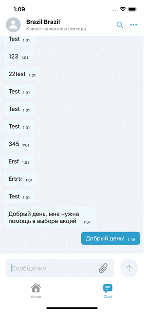
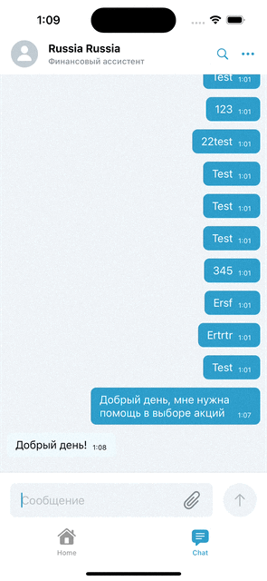
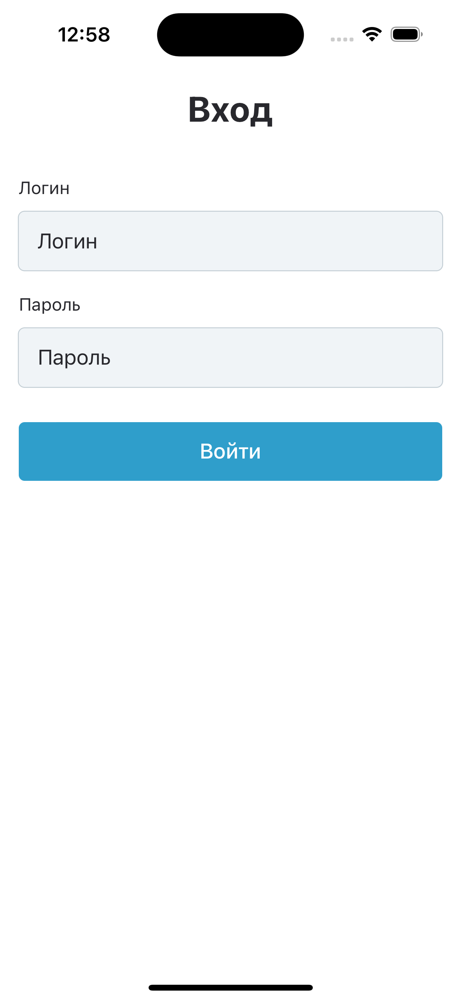
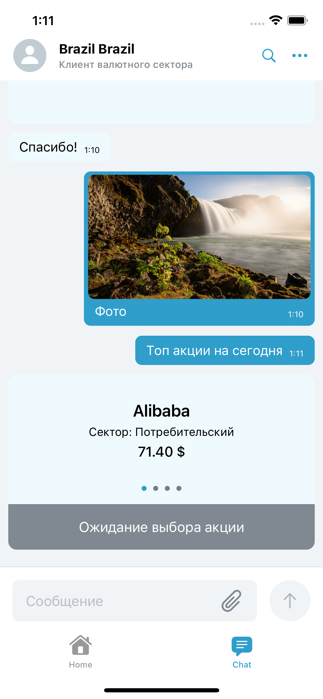
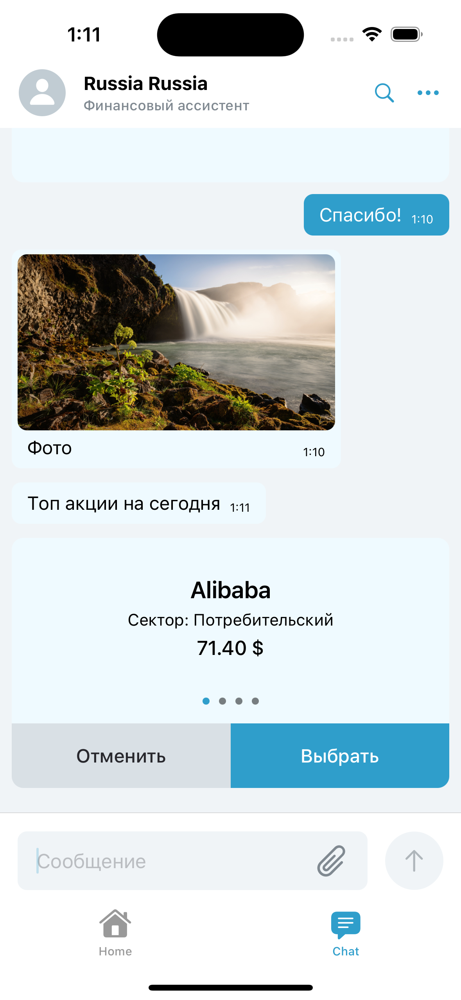

# Hack-ChangeAdvisory

MVVM Architecture, IOS 15.0+, device: iphone.

## Includes ( ALL SWIFTUI )
- Combine Framework
- Firebase Storage
- WebSocket
- REST API

## Релизован функционал

- Авторизация/Выход пользователя
- Отправка/прием текстовых сообщений в чате
- Отправка/прием документов в чате (фото)
- Отправка/прием виджетов в чате
- Взаимодействие с виджетами

### Real-time chat

### Screenshots

  
 

